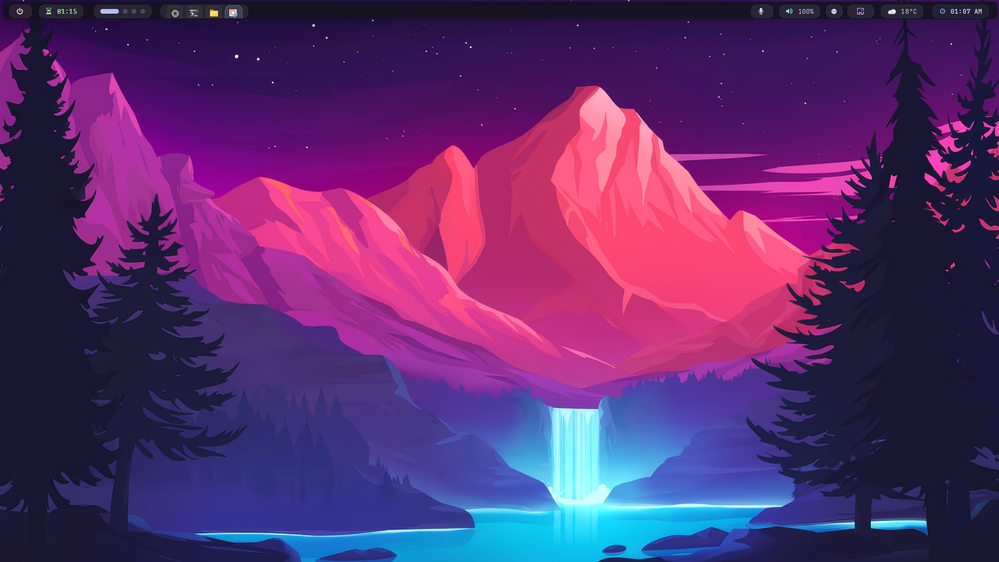
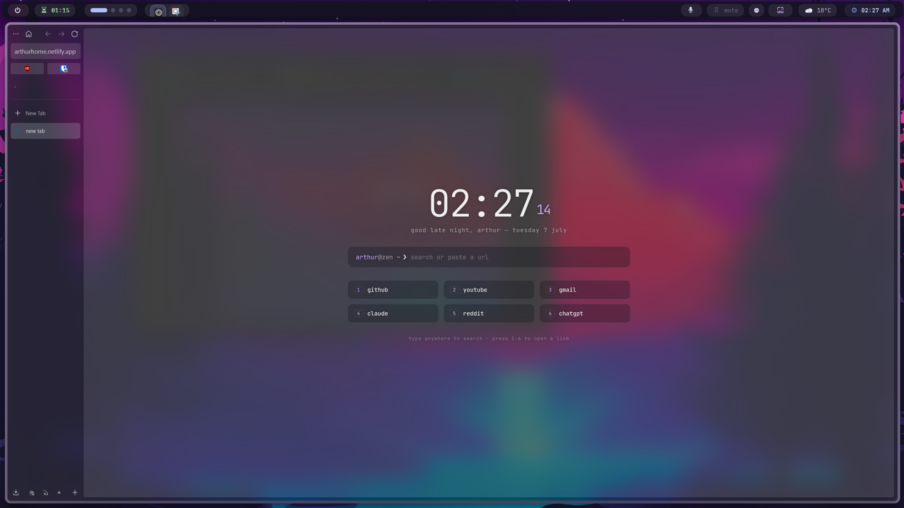
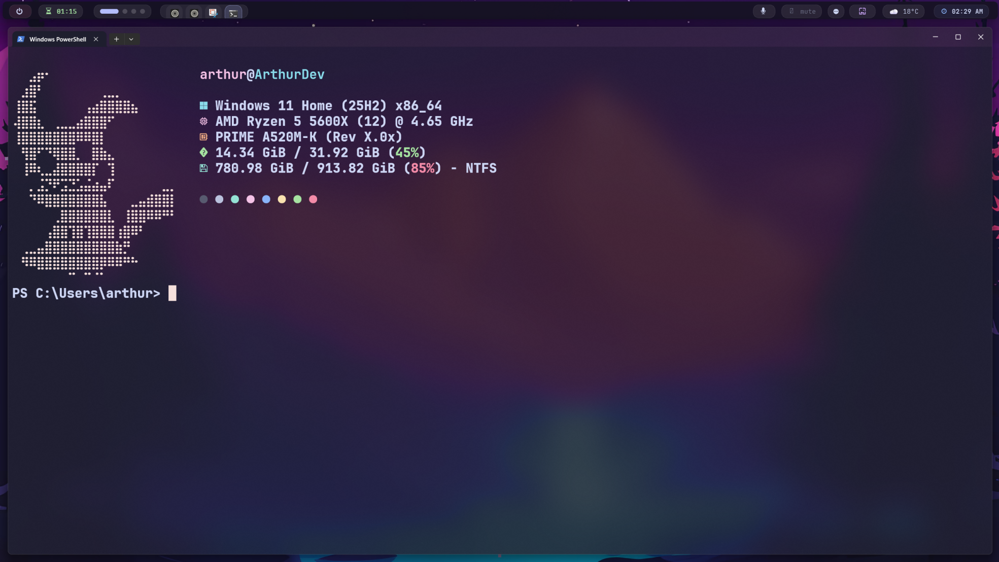

<div align="center">

# 🪟 windows-customization

**My Windows 11 customization and configuration files.**

A clean, keyboard-driven Windows 11 setup built around tiling window management and a minimal aesthetic.


</div>

---

## 📸 Preview

<!-- Add your screenshots here -->
<div align="center">
  

  

  

  
</div>

> More screenshots in the [`screenshots/`](screenshots) folder.

---

## 🧩 What's Inside

| Tool | Purpose | Config |
|------|---------|--------|
| [Komorebi](https://github.com/LGUG2Z/komorebi) | Tiling window manager | [`komorebi/`](komorebi) |
| [YASB](https://github.com/amnweb/yasb) | Status bar | [`yasb/`](yasb) |
| [Zen Browser](https://zen-browser.app/) | Browser theming (userChrome) | [`zen-browser/`](zen-browser) |

---

## ✨ Features

- **Tiling window management** — automatic layouts and workspace switching with Komorebi
- **Custom status bar** — system info, workspaces, and media controls via YASB
- **Themed browser** — minimal Zen Browser UI with custom `userChrome.css`
- **Consistent aesthetic** — unified colours and typography across the whole desktop
- **Documented setup** — full installation walkthrough in [`docs/setup-guide.md`](docs/setup-guide.md)

---

## 🚀 Getting Started

### Prerequisites

- Windows 11
- [winget](https://learn.microsoft.com/en-us/windows/package-manager/winget/) (pre-installed on Windows 11)

### Installation

1. **Clone the repo**
   ```powershell
   git clone https://github.com/arthur-devv/windows-customization.git
   cd windows-customization
   ```

2. **Install the tools**
   ```powershell
   winget install LGUG2Z.komorebi
   winget install AmN.yasb
   winget install Zen-Team.Zen-Browser
   ```

3. **Copy the configs**
   ```powershell
   # Komorebi
   Copy-Item komorebi\komorebi.json "$env:USERPROFILE\komorebi.json"

   # YASB
   Copy-Item yasb\config.yaml "$env:USERPROFILE\.config\yasb\config.yaml"

   # Zen Browser — copy userChrome.css into your profile's chrome folder
   # (about:profiles → Root Directory → chrome\userChrome.css)
   ```

4. **Follow the full guide** — see [`docs/setup-guide.md`](docs/setup-guide.md) for detailed, step-by-step instructions.

---

## 📁 Repository Structure

```
windows-customization/
├── docs/            # Setup guides and documentation
├── komorebi/        # Komorebi tiling WM configuration
├── screenshots/     # Desktop previews
├── yasb/            # YASB status bar configuration
├── zen-browser/     # Zen Browser userChrome.css
├── LICENSE
└── README.md
```

---

## 🗺️ Roadmap
- [ ] Add all the code
- [ ] Flow Launcher theme and settings
- [ ] Rainmeter widgets
- [ ] PowerShell profile and prompt setup
- [ ] One-command install script

---

## 🤝 Contributing

Found an issue or have a suggestion? Feel free to [open an issue](../../issues) or submit a pull request.

## 📄 License

This project is licensed under the [MIT License](LICENSE).

---

<div align="center">

Made with ☕ by [Arthur](https://github.com/arthur-devv)

⭐ Star this repo if you found it useful!

</div>
